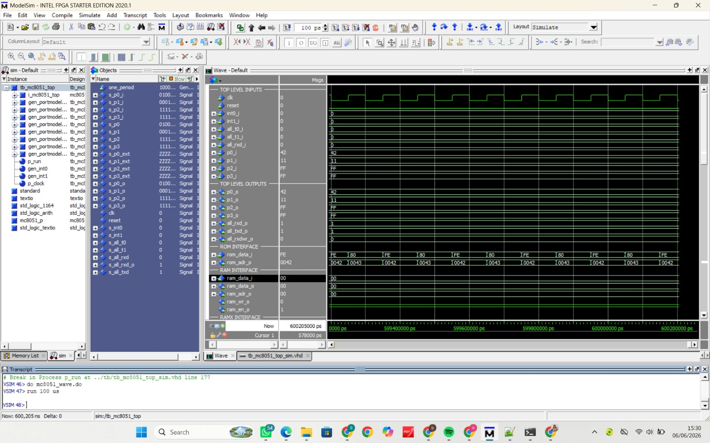

# 8051 Arithmetic Operations Using Intel 8051 Assembly Language

## Overview

This repository contains the implementation of basic arithmetic operations on the Intel 8051 microcontroller using Assembly language. The project was developed for the Computer Organization and Architecture course to demonstrate how arithmetic instructions are executed on an 8-bit architecture.

The implemented operations include:

- 8-bit Addition
- 8-bit Subtraction
- 8-bit Multiplication
- 8-bit Division
- 16-bit Addition
- 16-bit Subtraction
- 16-bit Multiplication (Software Routine)
- 16-bit Division (Software Routine)

The correctness of each program is verified through simulation using Oregano 8051 and ModelSim.

---

# Repository Structure

```
├── 8-bit
│   ├── add.asm
│   ├── sub.asm
│   ├── mul.asm
│   ├── div.asm
│   └── arith8_all.asm
│
├── 16-bit
│   ├── add16.asm
│   ├── sub16.asm
│   ├── mul16.asm
│   ├── div16.asm
│   └── arith16_all.asm
│
├── images
│   ├── 8-bit
│   └── 16-bit
│
├── report
│   └── laporan.pdf
│
└── README.md
```

---

# 8-bit Arithmetic Operations

## Addition

| Item | Description |
|------|-------------|
| Operand | 25H + 13H |
| Result | 38H |
| Main Instruction | ADD |
| Output | P1 = 38H |
| Status | ✅ Success |


---

## Subtraction

| Item | Description |
|------|-------------|
| Operand | 25H - 13H |
| Result | 12H |
| Main Instruction | CLR C, SUBB |
| Output | P1 = 12H |
| Status | ✅ Success |


---

## Multiplication

| Item | Description |
|------|-------------|
| Operand | 12H × 04H |
| Result | 48H |
| Main Instruction | MUL AB |
| Output | P1 = 48H |
| Status | ✅ Success |


---

## Division

| Item | Description |
|------|-------------|
| Operand | 25H ÷ 04H |
| Quotient | 09H |
| Remainder | 01H |
| Main Instruction | DIV AB |
| Output | p1_o = 09H, p2_o = 01H |
| Status | ✅ Success |


---

## Combined 8-bit Program

Program: **arith8_all.asm**

| Item | Description |
|------|-------------|
| Program | arith8_all.asm |
| Operations | ADD, SUB, MUL, DIV (8-bit) |
| ModelSim Output | p0_o = 35H, p1_o = 15H, p2_o = 48H, p3_o = 09H |
| Status | ✅ Success |


---

# 16-bit Arithmetic Operations

## Addition

| Item | Description |
|------|-------------|
| Operand | 1234H + 00F2H |
| Result | 1326H |
| Main Instruction | ADD, ADDC |
| Output | p0_o = 26H, p1_o = 13H |
| Status | ✅ Success |


---

## Subtraction

| Item | Description |
|------|-------------|
| Operand | 1234H - 00F2H |
| Result | 1142H |
| Main Instruction | CLR C, SUBB |
| Output | p0_o = 42H, p1_o = 11H |
| Status | ✅ Success |



---

## Multiplication

| Item | Description |
|------|-------------|
| Operand | 0012H × 0004H |
| Result | 0048H |
| Method | Software routine (Repeated Addition) |
| Output | p0_o = 48H, p1_o = 00H |
| Status | ✅ Success |


---

## Division

| Item | Description |
|------|-------------|
| Operand | 0025H ÷ 0004H |
| Quotient | 0009H |
| Remainder | 0001H |
| Method | Software routine (Repeated Subtraction) |
| Output | p0_o = 09H, p1_o = 00H, p2_o = 01H, p3_o = 00H |
| Status | ✅ Success |


---

## Combined 16-bit Program

Program: **arith16_all.asm**

| Item | Description |
|------|-------------|
| Operations | ADD 16-bit and SUB 16-bit |
| ADD Result | 1234H + 00F2H = 1326H |
| ADD Output | p0_o = 26H, p1_o = 13H |
| SUB Result | 1234H - 00F2H = 1142H |
| SUB Output | p2_o = 42H, p3_o = 11H |
| Status | ✅ Success |


---

# Summary

| Operation | Result |
|-----------|--------|
| ADD 8-bit | 38H |
| SUB 8-bit | 12H |
| MUL 8-bit | 48H |
| DIV 8-bit | Quotient = 09H, Remainder = 01H |
| ADD 16-bit | 1326H |
| SUB 16-bit | 1142H |
| MUL 16-bit | 0048H |
| DIV 16-bit | Quotient = 0009H, Remainder = 0001H |

---

# Development Environment

- Intel 8051 Assembly Language
- Oregano 8051 Simulator
- ModelSim

---

# Report

The complete project report is available in:

```
report/laporan.pdf
```

The report contains:

- Platform overview
- Program implementation
- Simulation procedure
- Experimental results
- Analysis from the perspective of Computer Organization and Architecture
- Comparison between 8-bit and 16-bit arithmetic operations

---

# Author
**Delviana Namira (24/542446/PA/23029), Khonsa Qonita Bahy (24/536263/PA/22753)
Salima Rodhiyatul Fitriyah (24/539756/PA/22917), Sonia Azizah Pramesjvari (24/538796/PA/22873)**

Computer Organization and Architecture Course Project
