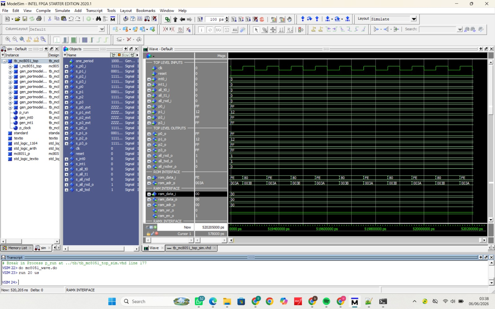

# 8051 Arithmetic Operation

Implementation of **8-bit** and **16-bit arithmetic operations using Intel 8051 Assembly Language**.

---

# 📖 Description

This project was developed as part of the **Computer Organization (Organisasi Komputer)** course assignment.

The objective of this project is to implement and analyze basic arithmetic operations on the Intel 8051 microcontroller using Assembly language. The project includes both **8-bit** and **16-bit** arithmetic operations and verifies their correctness through simulation.

---

# 📂 Repository Structure

```
Tugas-orkom-8051-Arithmetic-Operation
│
├── 8-bit
│   ├── add.asm
│   ├── sub.asm
│   ├── mul.asm
│   ├── div.asm
│   └── arith8_all.asm
│
├── 16-bit
│   ├── add16.asm
│   ├── sub16.asm
│   └── arith16_all.asm
│
├── images
│   ├── ADD8.jpeg
│   ├── SUB8.jpeg
│   ├── MUL8.jpeg
│   ├── DIV8.jpeg
│   ├── arith8_all.jpeg
│   └── arith16_all.jpeg
│
├── report
│   └── laporan.pdf
│
└── README.md
```

---

# 🧮 8-bit Arithmetic Operations

## Addition

| Operand | Result |
|----------|----------|
| 25H + 10H | 35H |

**Instruction:** `ADD`

### Simulation Result


---

## Subtraction

| Operand | Result |
|----------|----------|
| 25H - 10H | 15H |

**Instruction:** `CLR C` + `SUBB`

### Simulation Result



---

## Multiplication

| Operand | Result |
|----------|----------|
| 12H × 04H | 48H |

**Instruction:** `MUL AB`

### Simulation Result


---

## Division

| Operand | Result |
|----------|----------|
| 25H ÷ 04H | 09H (Remainder = 01H) |

**Instruction:** `DIV AB`

### Simulation Result


---

## Combined 8-bit Arithmetic

This program combines addition, subtraction, multiplication, and division into a single Assembly program.

### Simulation Result


---

# 🧮 16-bit Arithmetic Operations

## Addition

| Operand | Result |
|----------|----------|
| 1234H + 00F2H | 1326H |

**Instructions Used:**

- `ADD`
- `ADDC`

---

## Subtraction

| Operand | Result |
|----------|----------|
| 1234H - 00F2H | 1142H |

**Instructions Used:**

- `CLR C`
- `SUBB`

---

## Combined 16-bit Arithmetic

This program combines 16-bit addition and subtraction using the carry flag.

### Simulation Result


---

# 📊 Summary

| Operation | Output |
|------------|------------|
| 8-bit Addition | 35H |
| 8-bit Subtraction | 15H |
| 8-bit Multiplication | 48H |
| 8-bit Division | 09H |
| 16-bit Addition | 1326H |
| 16-bit Subtraction | 1142H |

---

# 💻 Development Environment

- Intel 8051 Assembly Language
- Oregano 8051
- ModelSim

---

# 📄 Project Report

The complete project report is available in:

```
report/laporan.pdf
```

The report contains:

- Platform description
- Program explanation
- Simulation procedure
- Execution results
- Analysis from the perspective of computer organization and architecture
- Comparison between 8-bit and 16-bit arithmetic operations

---

# 👨‍💻 Author

**- Delviana Namira (24/542446/PA/23029)**
**- Khonsa Qonita Bahy (24/536263/PA/22753)**
**- Salima Rodhiyatul Fitriyah (24/539756/PA/22917)**
**- Sonia Azizah Pramesjvari (24/538796/PA/22873)**

Computer Organization Course Project

Intel 8051 Arithmetic Operation
